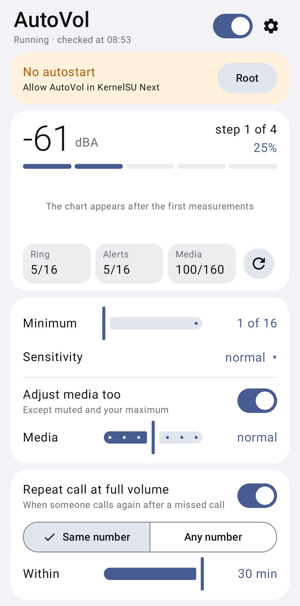

# AutoVol

The ring volume follows the noise around you: quiet in a quiet room, loud in a noisy place.

[Русский](README.md)

 

## What it does

- Every few minutes it listens to the surroundings for 2 seconds and sets the ring and notification
  volume.
- Ignores one-off sounds: a knock, a door, a notification sound.
- Changes nothing when the phone is on silent or vibrate, in Do Not Disturb, during a call, with
  headphones or in the car.
- If you change the volume yourself, AutoVol leaves it alone for half an hour and remembers whether
  you wanted it louder or quieter.
- Optional: media volume follows the noise too; if someone calls back after a missed call, the phone
  rings at full volume.

## How to install

1. Open the [latest version](../../releases/latest) and download the `AutoVol-….apk` file.
2. Open the downloaded file and install it. Your phone may ask to allow the installation — allow it.
3. Start AutoVol, turn on the switch at the top and allow the microphone and notifications.

Requires Android 10 or newer. The app offers new versions by itself.

## After a reboot

Android does not let apps turn on the microphone by themselves after a reboot. AutoVol shows a
notification — tap it and everything continues.

With root (KernelSU, Magisk, APatch) AutoVol can start by itself: allow root for it in the manager
app and tap “Root” on AutoVol's main screen.

## This is normal

- A green microphone dot for 2 seconds every few minutes is the noise measurement. The sound is not
  saved or sent anywhere.
- Internet is only used to check for new versions.

## If something is wrong

In AutoVol open ⚙ → “Event log” → “Share” and send the log to the author.
