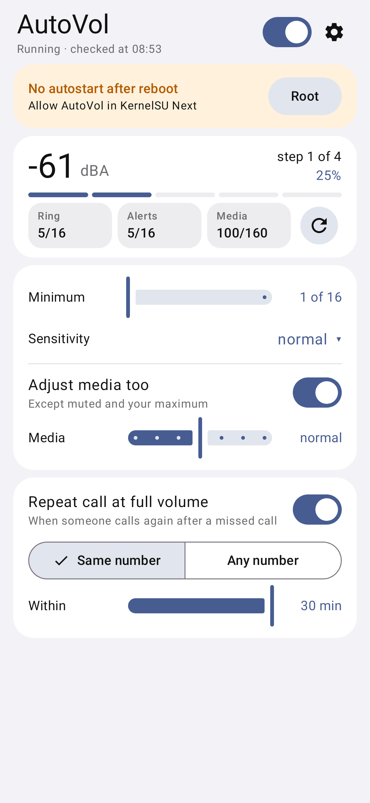
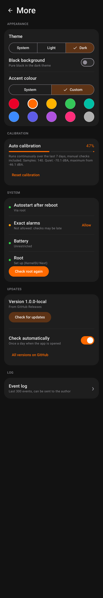

# AutoVol — ring volume that follows ambient noise

[Русский](README.md)

An Android app that listens to the surroundings for 2 seconds every 1–5 minutes and sets the ring and
notification volume: minimum in a quiet room, step by step up to maximum in a noisy place.

- A single spike (a knock, a notification sound) does not raise the volume: an increase is confirmed
  by a second measurement 12 s later.
- When it gets quiet, the volume goes back down quickly, but a pause between songs does not reset it.
- Does nothing in vibrate/silent mode, Do Not Disturb, during calls, with headphones or Bluetooth,
  in car mode, on low battery and while the phone itself is playing sound.
- If you change the volume yourself, AutoVol leaves it alone for 30 minutes.
- Noise is measured in dBA, so barely audible rumble does not count. Thresholds calibrate
  themselves continuously over the last 7 days.
- Separate sensitivity for ring/notifications and for media.
- Optional: media volume follows the noise too (muted media and media you turned all the way up are
  left alone).
- Optional: if someone calls again after a missed call (same number or any number), the phone rings
  at full volume. Needs the “Phone” permission and, for “same number”, call log access. Not in vibrate.
- No ads, no analytics. The only network access is the optional update check on GitHub Releases.

## Install

Download the APK from [Releases](../../releases). After that the app updates itself
(More → Updates). Android 10 or newer.

## Autostart after reboot

Android does not let apps record in the background, and after a reboot it does not let an app start a
microphone service by itself. So:

1. **Without root** nothing is needed: AutoVol works while its notification is shown. After a reboot a
   notification asks you to tap to resume.
2. **With root (KernelSU / KernelSU Next / SukiSU, Magisk, APatch)**: allow AutoVol in the root manager,
   then tap “Root” on the main screen. After a reboot the service is started by root, which Android
   treats as a system start, so the microphone works in the background without a tap. Users without
   root see nothing about root in the app.
3. **adb** (`adb shell appops set --uid io.github.z3f1rr.autovol RECORD_AUDIO allow`) is unreliable on
   Android 11+: the system usually resets it right away or after a reboot.

## Limitations

- The green microphone indicator shows up during each 2-second measurement — this is expected.
- If the microphone is used by another app or disabled by the privacy toggle, the measurement is
  skipped.
- For precise intervals allow “Alarms & reminders”; for reliable work set the battery mode to
  “Unrestricted” (the app shows both in More → System).

## Build

`./gradlew assembleDebug` (JDK 21, Android SDK). Tests: `./gradlew testDebugUnitTest` — the decision
logic, plus the Android layer on Android 10/12/14/16 via Robolectric and screenshots
(`app/build/outputs/roborazzi`). Release signing on GitHub Actions: see `docs/SIGNING.md` (Russian).

## Screenshots

 
