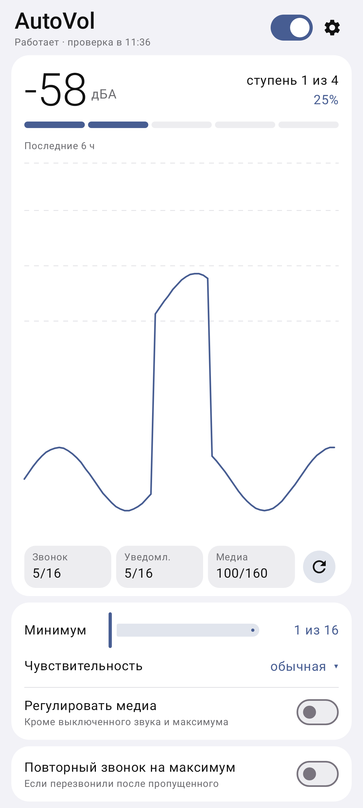

# AutoVol

Громкость звонка сама подстраивается под шум вокруг: в тишине звонок тихий, в шумном месте — громкий.

[English](README.en.md)

 

## Что умеет

- Раз в несколько минут слушает шум 2 секунды и выставляет громкость звонка и уведомлений.
- Не реагирует на случайные звуки: стук, хлопок двери, звук уведомления.
- Ничего не меняет, когда телефон на беззвучном или вибро, в режиме «Не беспокоить», во время
  разговора, в наушниках и в машине.
- Если вы сами поменяли громкость, AutoVol не вмешивается полчаса и запоминает, что вам нужно
  громче или тише.
- По желанию: громкость музыки и видео тоже под шум; если перезванивают после пропущенного
  звонка — звонок на полной громкости.

## Как установить

1. Откройте [последнюю версию](../../releases/latest) и скачайте файл `AutoVol-….apk`.
2. Откройте скачанный файл и установите. Телефон может попросить разрешить установку — разрешите.
3. Запустите AutoVol, включите переключатель вверху и разрешите доступ к микрофону и уведомлениям.

Нужен Android 10 или новее. Новые версии приложение предложит само.

## После перезагрузки телефона

Android не разрешает приложениям самим включать микрофон после перезагрузки. Появится уведомление
AutoVol — нажмите на него, и всё продолжит работать.

Если на телефоне есть root (KernelSU, Magisk, APatch), AutoVol может запускаться сам: разрешите ему
root в приложении-менеджере и нажмите «Root» на главном экране AutoVol.

## Это нормально

- Зелёная точка микрофона на 2 секунды раз в несколько минут — это замер шума. Звук не
  сохраняется и никуда не отправляется.
- Интернет нужен только для проверки новых версий.

## Если что-то работает не так

В AutoVol откройте ⚙ → «Журнал событий» → «Поделиться» и отправьте журнал автору.
