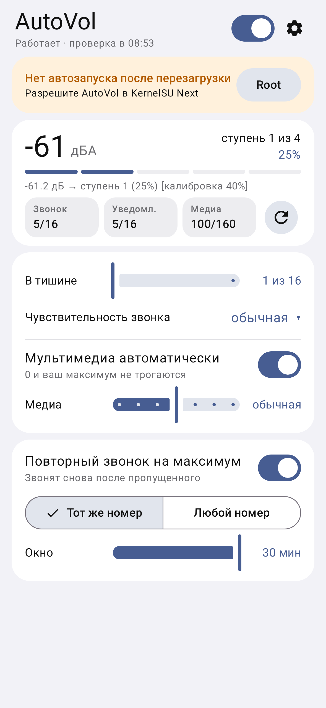
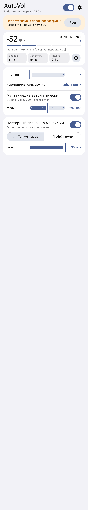

# AutoVol — автогромкость звонка по окружающему шуму

Приложение для Android: раз в 1–5 минут на 2 секунды слушает микрофоном окружающий шум и
выставляет громкость звонка и уведомлений. В тишине — минимум, в шуме — ступенчато до максимума.

- Одиночный всплеск (стук, звук уведомления) громкость не поднимает — повышение подтверждается
  повторным замером через 12 с.
- Когда стало тихо, громкость возвращается вниз быстро, но пауза между песнями не сбрасывает её.
- Ничего не трогает в режиме вибро/без звука, в «Не беспокоить», во время звонка, при
  Bluetooth/проводных наушниках/Android Auto, при низком заряде и пока телефон сам играет звук.
- Если вы сами изменили громкость — приложение не вмешивается 30 минут.
- Пороги шума подстраиваются под ваши условия сами и постоянно — по последним 7 дням замеров
  (заметно уже через ~30 замеров, полностью — через ~300).
- Чувствительность отдельно для звонка/уведомлений и для мультимедиа.
- По желанию — громкость мультимедиа тоже следует за шумом. Выключенное (0) или выкрученное вами
  на максимум медиа не трогается.
- Уровень шума меряется в дБА (как у шумомеров): гул и вибрации, которые почти не слышны, не мешают.
- По желанию: если после пропущенного звонка звонят снова (с того же номера или с любого — на выбор),
  звонок звучит на максимальной громкости. Нужны разрешения «Телефон» и, для режима «с того же
  номера», «Журнал вызовов». В режиме вибро/без звука не срабатывает.
- Без интернета, рекламы и аналитики. Root не нужен.

## Установка

Скачайте APK из [Releases](../../releases) и установите. Тестовые сборки — во вкладке
Actions → последний запуск → Artifacts.

Требуется Android 10 или новее.

## Автозапуск после перезагрузки

Android не даёт приложениям слушать микрофон в фоне, а после перезагрузки запрещает самостоятельно
запускать сервис с микрофоном. Поэтому:

1. **Без root** (ничего делать не нужно). Автогромкость работает, пока висит её уведомление. После
   перезагрузки появится уведомление «Нажмите, чтобы возобновить автогромкость».
2. **С root (KernelSU / KernelSU Next / SukiSU, Magisk, APatch)** — рекомендуется. Разрешите AutoVol
   в root-менеджере (в KernelSU: Суперпользователь → AutoVol), затем на главном экране нажмите
   «Настроить через root». После перезагрузки сервис запускается от имени root — так Android
   разрешает ему микрофон в фоне, без касаний. Заодно выдаются разрешения, точные будильники и
   снимаются ограничения батареи. Пользователи без root ничего про root в приложении не видят.
3. **adb** (`adb shell appops set --uid io.github.z3f1rr.autovol RECORD_AUDIO allow`) — на Android 11+
   система обычно сразу или после перезагрузки возвращает режим «только при использовании», поэтому
   этот способ ненадёжен.

## Обновления

Приложение раз в сутки (можно отключить) проверяет новые версии в GitHub Releases и обновляется
само: «Ещё» → «Обновления» → «Обновить». Без root нужно один раз разрешить AutoVol «Установку
неизвестных приложений»; с root установка проходит без вопросов. Это единственное, для чего
приложению нужен интернет.

## Ограничения

- Во время замера (2 секунды) в строке состояния загорается зелёная точка микрофона — это нормально.
- Если микрофон занят другим приложением или выключен переключателем конфиденциальности, замер
  пропускается.
- Для точных интервалов нужно разрешение «Будильники и напоминания», а для надёжной работы —
  режим батареи «Без ограничений» (приложение подскажет).

## Сборка

`./gradlew assembleDebug` (JDK 21, Android SDK). Тесты: `./gradlew testDebugUnitTest` — логика,
плюс Android-часть на Android 10/12/14/16 через Robolectric и скриншоты экрана
(`app/build/outputs/roborazzi`).
Подпись релизов через GitHub Actions — см. [docs/SIGNING.md](docs/SIGNING.md).

## Скриншоты

  

